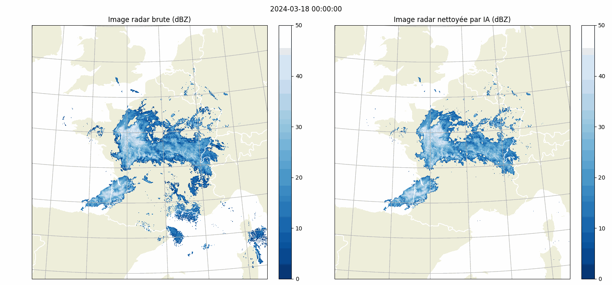
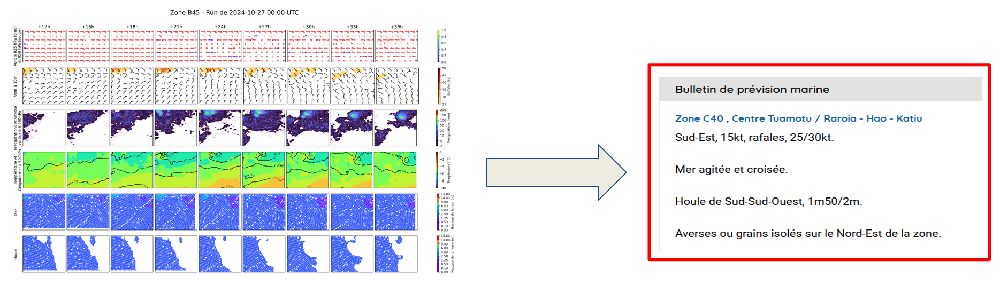

# MFAI: Météo-France's AI Python package


**MFAI** is a Python package that provides the following features:
- A variety of PyTorch Neural Network architectures (CNN, Vision Transformers, small LLMs, small mulitmodal LMs...) adapted to our needs, tested on our projects and datasets. For each architecture, we provide the reference to the original paper and source code if applicable and also the modifications we made.
- Per architecture schema validated settings using [dataclasses-json](https://github.com/lidatong/dataclasses-json)
- A NamedTensor class to handle multi-dimensional data with named dimensions and named features (a single containing object for a tensor and its metadata)
- Various losses from the litterature, often tailored to our projects and experimental results
- Lightning module to speedup recurring tasks: segmentation, regression, DGMR training, ... 

# Use Cases

We solve a variety of AI modeling tasks applied to weather data using mfai, you can find some examples below of projects in production at Météo-France.

| **Front Detection**       |  **Radar image artefact removal** |
|:-------------------------:|:-------------------------:|
| UNetRPP for multiclass segmentation | UNet for binary segmentation |
||  |


| **Rainfall estimation from satellite channels**|  **Macroalgae detection on satellite channels**|
|:-------------------------:|:-------------------------:|
| HalfUnet for regression | HalfUnet for binary segmentation |
  |  |


We also have past and ongoing R&D projects:

| **LAM weather forecasting in py4cast (past)**       |  **Text generation from weather data** |
|:-------------------------:|:-------------------------:|
| UNetRPP/HiLAM for regression | Fuyu for multimodal text generation|
  | 


If you are interested about the technical details of these projects (precise neural network architecture and hyperparameters, source code, ...) feel free to contact us. Most of our projects are proprietary but we can collaborate with other meteorological public institutions.

# Table of Content

- [Use Cases](#use-cases)
- [Neural Network Architectures](#neural-network-architectures)
    - Convolutional Neural Networks:
      - deeplabv3/deeplabv3+
      - halfunet
      - unet/customunet
      - Resnet50, with a specific last stage to output multiple tokens (for MLM)
    - Vision Transformers:
      - segformer
      - swinunetr
      - unetr++
      - PanguWeather
      - ArchesWeather
    - Generative Adversarial Networks:
      - DGMR
    - Graph Neural Networks:
      - HiLAM
      - GraphLAM
    - Large Language Models (LLMs):
      - GPT2 (classical and cross attention version)
      - LLama2
    - Multimodal Language Models (MLMs):
      - A custom Fuyu inspired model
      - A custom model combining a Resnet50 vision encoder with a cross attention GPT2
    - Vision Language Models:
      - CLIP

- [LightningModule](#lightning-modules)
    - Segmentation
    - CLIP
    - DGMR
- [Lightning CLI](#lightning-cli)
- [NamedTensors](#namedtensors)
- [Metrics](#metrics)
    - Critical Sucess Index
    - False Alarm Rate
    - False Negative Rate
    - Precision-Recall Area Under Curve
- [Losses](#losses)
  - DiceLoss
  - SoftCrossEntropyLoss
  - SoftBCEWithLogitsLoss
  - Perceptual loss
  - LPIPS
  - GridCell loss and Hinge losses for GANs
- [Transforms](#transforms)
- [Installation](#installation)
- [Usage](#usage)
    - [Instanciate a model](#instanciate-a-model)
    - [Export to onnx](#export-to-onnx)
    - [NamedTensors](#namedtensors-example)
- [Running tests](#running-tests)
- [Contributing](#contributing)
- [Publishing](#publishing)
- [Citation](#citation)
- [Acknowledgements](#acknowledgements)

# Neural Network Architectures

Currently we support the following neural network architectures:


## Convolutional Neural Networks

| Model  | Research Paper  | Input Shape    | ONNX exportable ? | Notes | Use-Cases at MF |
| :---:   | :---: | :---: | :---: | :---: | :---: |
| [DeepLabV3Plus](mfai/pytorch/models/deeplabv3.py#L1) | [arxiv link](https://arxiv.org/abs/1802.02611) | (Batch, features, Height, Width)    | Yes | As a very large receptive field versus U-Net, Half-Unet, ... | Front Detection, Nowcasting |
| [HalfUNet](mfai/pytorch/models/half_unet.py#L1) | [researchgate link](https://www.researchgate.net/publication/361186968_Half-UNet_A_Simplified_U-Net_Architecture_for_Medical_Image_Segmentation) | (Batch, features, Height, Width)    | Yes | In prod/oper on [Espresso](https://www.mdpi.com/2674-0494/2/4/25) V2 with 128 filters and standard conv blocks instead of ghost | Satellite channels to rain estimation |
| [UNet](mfai/pytorch/models/unet.py#L1) | [arxiv link](https://arxiv.org/pdf/1505.04597.pdf) | (Batch, features, Height, Width)    | Yes | Vanilla U-Net | Radar image cleaning |
| [CustomUNet](mfai/pytorch/models/unet.py#L1) | [arxiv link](https://arxiv.org/pdf/1505.04597.pdf) | (Batch, features, Height, Width)    | Yes | U-Net like architecture with a variety of resnet encoder choices | Radar image cleaning |
| [custom Resnet50](mfai/pytorch/models/resnet.py#L230) | [arxiv link](https://arxiv.org/pdf/1512.03385) | (Batch, features, Height, Width)    | Yes | A slightly customised Resnet50 outputing (batch, num_tokens, embed_dim) for multimodal LM weather/image encoding | Weather + text to text in MLMs |


## Vision Transformers

| Model  | Research Paper  | Input Shape    | ONNX exportable ? | Notes | Use-Cases at MF |
| :---:   | :---: | :---: | :---: | :---: | :---: |
| [Segformer](mfai/pytorch/models/segformer.py#L1) | [arxiv link](https://arxiv.org/abs/2105.15203)   | (Batch, features, Height, Width) | Yes | On par with u-net like on Deepsyg (MF internal), added an upsampling stage. Adapted from [Lucidrains' github](https://github.com/lucidrains/segformer-pytorch) | Segmentation tasks |
| [SwinUNetR](mfai/pytorch/models/swinunetr.py#L1) | [arxiv link](https://arxiv.org/abs/2201.01266)   | (Batch, features, Height, Width)  | No | 2D Swin  Unet transformer (Pangu and archweather uses customised 3D versions of Swin Transformers). Plugged in from [MONAI](https://github.com/Project-MONAI/MONAI/). The decoders use Bilinear2D + Conv2d instead of Conv2dTranspose to remove artefacts/checkerboard effects | Segmentation tasks  |
| [UNetRPP](mfai/pytorch/models/unetrpp.py#L1) | [arxiv link](https://arxiv.org/abs/2212.04497)  | (Batch, features, Height, Width) or (Batch, features, Height, Width, Depth) | Yes | Vision transformer with a reduced GFLOPS footprint adapted from [author's github](https://github.com/Amshaker/unetr_plus_plus). Modified to work both with 2d and 3d inputs. The decoders use Bilinear2D + Conv2d instead of Conv2dTranspose to remove artefacts/checkerboard effects  | Front Detection, LAM Weather Forecasting |
| [PanguWeather](mfai/pytorch/models/pangu.py#L1) | [arxiv link](http://arxiv.org/abs/2211.02556)  | (Batch, features, Height, Width) and (Batch, features, Height, Width, Depth) | Yes | 3D Earth-specific transformer based on Swin transformers adapted from [author's github](https://github.com/198808xc/Pangu-Weather) pseudo-code and implemented by Atos Eviden | (LAM) Weather Forecasting |
| [ArchesWeather](mfai/pytorch/models/archesweather.py#L1) | [arxiv link](http://arxiv.org/abs/2405.14527)  | (Batch, features, Height, Width) and (Batch, features, Height, Width, Depth) | Yes | 3D Earth-specific transformer using Pangu code with axial attention, based on [author's repository](https://github.com/gcouairon/ArchesWeather/tree/main) and implemented by Atos Eviden| (LAM) Weather Forecasting |
| [VIT](mfai/pytorch/models/vit.py#L1) | [openreview link](https://openreview.net/pdf?id=YicbFdNTTy)  | (Batch, features, Height, Width) | Yes | VIT implementation slightly adapted from [lucidrain's github](https://github.com/lucidrains/vit-pytorch/blob/main/vit_pytorch/vit.py) | two flavours: Full sample/image classification + Vision encoding for MLMs|

## Generative Adversarial Networks

| Model  | Research Paper  | Input Shape    | ONNX exportable ? | Notes | Use-Cases at MF |
| :---:   | :---: | :---: | :---: | :---: | :---: |
| [DGMR](mfai/pytorch/models/gan_dgmr) | [Nature](https://www.nature.com/articles/s41586-021-03854-z)  | (batch time features height width) | No | Imported and adapted from [OpenClimateFix](https://github.com/openclimatefix/skillful_nowcasting) | [Training DGMR for precipitation nowcasting](https://github.com/meteofrance/dgmr) |

## Graph Neural Networks

| Model  | Research Paper  | Input Shape    | ONNX exportable ? | Notes | Use-Cases at MF |
| :---:   | :---: | :---: | :---: | :---: | :---: |
| [HiLAM, GraphLAM](mfai/pytorch/models/nlam/__init__.py) | [arxiv link](https://arxiv.org/abs/2309.17370)  | (Batch, graph_node_id, features)   | No | Imported and adapted from [Joel's github](https://github.com/joeloskarsson/neural-lam) |

## Large Language Models

| Model  | Research Paper  | Input Shape    | ONNX exportable ? | Notes | Use-Cases at MF |
| :---:   | :---: | :---: | :---: | :---: | :---: |
| [GPT2](mfai/pytorch/models/llms/gpt2.py) | [openai paper](https://cdn.openai.com/better-language-models/language_models_are_unsupervised_multitask_learners.pdf)  | (Batch, token_id) | No   | Imported and adapted from [Sebastian Raschka's book and github](https://github.com/rasbt/LLMs-from-scratch/) |
| [Llama2](mfai/pytorch/models/llms/llama2.py) | [arxiv link](https://arxiv.org/abs/2307.09288)  | (Batch, token_id) | No  | Imported and adapted from [Sebastian Raschka's book and github](https://github.com/rasbt/LLMs-from-scratch/) |
| [Custom GPT-2 with Cross Attention](mfai/pytorch/models/llms/__init__.py#L372) | | (Batch, token_id, other) | No  | Inspired from [Sebastian Raschka's blog](https://magazine.sebastianraschka.com/p/understanding-multimodal-llms) |

## Multimodal Language Models

| Model  | Research Paper  | Input Shape    | ONNX exportable ? | Notes | Use-Cases at MF |
| :---:   | :---: | :---: | :---: | :---: | :---: |
|[Custom Fuyu Like Model](mfai/pytorch/models/llms/fuyu.py#L37)| [arxiv link](https://arxiv.org/abs/2307.09288)  | (Batch, token_id) for text, (Batch, Lat, Lon, Timestep, Features) for weather inputs | No | Inspired from [Adept AI blog post](https://www.adept.ai/blog/fuyu-8b)  and [Sebastian Raschka's blog](https://magazine.sebastianraschka.com/p/understanding-multimodal-llms). We propose 3 different vision encoders: linear, resnet50, vit | Marine text product generation |
|[Custom Cross Attention weather + text MLM combining a resnet50 and a cross attention GPT-2](mfai/pytorch/models/llms/cross_attention.py)|  | (Batch, token_id) for text, (Batch, Lat, Lon, Timestep, Features) for weather inputs | No | Inspired from [Sebastian Raschka's blog](https://magazine.sebastianraschka.com/p/understanding-multimodal-llms) | Marine text product generation |

## Vision Language Models

| Model  | Research Paper  | Input Shape    | ONNX exportable ? | Notes | Use-Cases at MF |
| :---:   | :---: | :---: | :---: | :---: | :---: |
|[CLIP](mfai/pytorch/models/clip.py#30)| [arxiv link](https://arxiv.org/abs/2103.00020)  | (Batch, token_id) for text, (Batch, Features, Lat, Lon) | No | Usefull to pre-train a Vision Encoder | Marine text product generation |

<details>
<summary>Details about our models</summary>

Except for LLMs and MLLMs, each model we provide is a subclass of [torch.nn.Module](https://pytorch.org/docs/stable/generated/torch.nn.Module.html) and can be used in a PyTorch training loop. It has multiple class attributes to facilitate model usage in a project:
- **settings_kls**: a class that defines the settings of the model (number of filters, kernel size, ...). It is used to instanciate the model with a specific configuration.
- **onnx_supported**: a boolean that indicates if the model can be exported to onnx. Our CI validates that the model can be exported to onnx and reloaded for inference.
- **supported_num_spatial_dims**: a tuple that describes the spatial dimensions of the input tensor supported by the model. A model that supports 2D spatial data will have **(2,)** as value. A model that supports 2d or 3d spatial data will have **(2, 3)** as value.
- **num_spatial_dims**: an integer that describes the number of spatial dimensions of the input/output tensor expected by the instance of the model, must be a value in **supported_num_spatial_dims**.
- **settings**: a runtime property returns the settings instance used to instanciate the model.
- **model_type**: an Enum describing the type of model: CONVOLUTIONAL, VISION_TRANSFORMER, GRAPH, LLM, MLLM.
- **features_last**: a boolean that indicates if the features dimension is the last dimension of the input/output tensor. If False, the features dimension is the second dimension of the input/output tensor.
- **register**: a boolean that indicates if the model should be registered in the **MODELS** registry. By default, it is set to False which allows the creation of intermediate subclasses not meant for direct use.

The Python interface contract for our model is enforced using [Python ABC](https://docs.python.org/3/library/abc.html) and in our case [ModelABC](mfai/pytorch/models/base.py#L1) class. This class is combined to `torch.nn.Module` in [BaseModel](mfai/pytorch/models/base.py#L1).

```python
@dataclass_json
@dataclass(slots=True)
class HalfUNetSettings:
    num_filters: int = 64
    dilation: int = 1
    bias: bool = False
    use_ghost: bool = False
    last_activation: str = "Identity"
    absolute_pos_embed: bool = False

class HalfUNet(BaseModel):
    settings_kls = HalfUNetSettings
    onnx_supported: bool = True
    supported_num_spatial_dims = (2,)
    num_spatial_dims: int = 2
    features_last: bool = False
    model_type: int = ModelType.CONVOLUTIONAL
    register: bool = True
```
</details>

All models can be imported directly from the `mfai.pytorch.models` package. For example, to import the UNet model, you can use:

```python
from mfai.pytorch.models import UNet
```

To instanciate a settings class for a model, you can use the `settings_kls` attribute of the model class. For example, to create a settings instance for the HalfUNet model and use it to instanciate the model, you can do:

```python
from mfai.pytorch.models import HalfUNet
settings = HalfUNet.settings_kls(num_filters=128, use_ghost=True)
model = HalfUNet(in_channels=3, out_channels=2, input_shape=(64,64), settings=settings)
```


# Lightning Modules

A Lightning Module is a high-level interface in PyTorch Lightning that encapsulates the model, training, validation, and testing logic, promoting modularity and ease of use in deep learning projects.

The module provides:
- customization for each stage of the training
- metrics and plot logging with tensorboard
- logging of configuration and hyperparameters
- computation of several metrics during validation stage
- test stage: compute metrics for each sample individualy and save them in CSV file

Obviously, if one of the implemented methods, metrics, etc. is not suitable for your problem, it is always possible to overload them so that the lightningmodule adapts to your needs.

**Example:**

We want here to log some figures in the TensorBoard, so we overload the default `val_plot_step()` method.
```python
from mfai.pytorch.lightning_modules import SegmentationLightningModule

class MyProjectLightningModule(SegmentationLightningModule):
    def val_plot_step(self, batch_idx, y, y_hat):
        """Log prediction made for the first image of batches (6, 14, 48, 78) in tensorboard."""
        interesting_batches = [6, 14, 48, 78]
        if batch_idx in interesting_batches:
            fig = plot_pred_and_target(y=y[0], y_hat=y_hat[0])

            tb = self.logger.experiment
            tb.add_figure(f"val_plots/test_figure_{batch_idx}", fig, self.current_epoch)
```

## Segmentation
We provide [**SegmentationLightningModule**](/mfai/pytorch/lightning_modules/segmentation.py#21) a lightning module adapted to supervised Deep Learning projects where the input of the neural network is made of one or multiple images and the target is also one or multiple images.

The module can be instanciated with any of the aforementioned vision neural networks architetures and used in 4 different modes : binary classification, multiclass classification, multilabel classification and regression.

By default, some metrics are computed in function of the mode of segmentation you use:
- Binary, Multiclass, Multilabel: [`Accuracy`](https://lightning.ai/docs/torchmetrics/stable/classification/accuracy.html), [`F1Score`](https://lightning.ai/docs/torchmetrics/stable/classification/f1_score.html#torchmetrics.F1Score), [`Recall`](https://lightning.ai/docs/torchmetrics/stable/classification/recall.html), [`Precision`](https://lightning.ai/docs/torchmetrics/stable/classification/precision.html),
- Regression: [`MeanSquaredError`](https://lightning.ai/docs/torchmetrics/stable/regression/mean_squared_error.html), [`MeanAbsoluteError`](https://lightning.ai/docs/torchmetrics/stable/regression/mean_absolute_error.html#torchmetrics.MeanAbsoluteError), [`MeanAbsolutePercentageError`](https://lightning.ai/docs/torchmetrics/stable/regression/mean_absolute_percentage_error.html#torchmetrics.MeanAbsolutePercentageError).

## Clip
We also provide [**CLIPLightningModule**](/mfai/pytorch/lightning_modules/clip.py#19), a lightning module dedicated to the training of CLIP models.

This module can be instanciated with a simple [ClipSettings](/mfai/pytorch/models/clip.py#19) that informs which image and text encoders to use as well as the embedding size and the initial temperature.

## DGMR

[DGMRLightningModule](/mfai/pytorch/lightning_modules/gan_dgmr.py) is a Pytorch Lightning Module dedicated to training the [DGMR](https://www.nature.com/articles/s41586-021-03854-z) model for precipitation nowcasting.

Code for the GAN architecture is [here](mfai/pytorch/models/gan_dgmr).

This lightning module is largely inspired by [this work](https://github.com/openclimatefix/skillful_nowcasting) from OpenClimateFix.

To find an example of how to use it, check out [this repository](https://github.com/meteofrance/dgmr), where we train the DGMR model from scratch on French radar data.

# Lightning CLI

[Lightning CLI](https://lightning.ai/docs/pytorch/stable/cli/lightning_cli.html#lightning-cli) is a convenient way to easily configure your DL experiments and reduce the number of lines of code in your project.

We provide an example of usage of the Lightning CLI with our lightning module and an exemple of config file to launch an experiment.

# NamedTensors

PyTorch provides an experimental feature called [**named tensors**](https://pytorch.org/docs/stable/named_tensor.html), at this time it is subject to change so we don't use it. That's why we provide our own implementation.

Our **NamedTensor** class is a wrapper around a PyTorch tensor that adds named dimensions and named features to the tensor. It is useful to handle multi-dimensional data with named dimensions and named features.

You can find the documentation of the NamedTensor class **[here](doc/namedtensor.md)**.

# Metrics

In addition to metrics available in [**torchmetrics**](https://lightning.ai/docs/torchmetrics/stable/), we implement :
- Criticall Sucess Index (CSI) is given by: TP / (TP+FP+FN). This metric, usefull in meteorology, takes into account both false alarms and missed events in a neighborhood to avoid the phenomenon of double penalty.
- False Alarm Rate (FAR) is given by: FP / (FP + TP).
- False Negative Rate (FNR) is given by: FN / (FN + TP).
- Precision-Recall Area Under the Curve (PR AUC). This metric summarize the overall performance of a model without depending on a threshold. It can be used in place of the Area Under ROC Curve when the dataset is too unbalanced.

# Losses

Pytorch already provide some Loss like Mean Squared Error (torch.nn.MSELoss) or Mean Absolute Error (torch.nn.L1Loss). Here we add two loss functions that focus on perceptual similarity of tensors and four loss functions used for nowcasting with GANs (DGMR).

We also provide slightly modified losses (DiceLoss, SoftCrossEntropyLoss, SoftBCEWithLogitsLoss) adapted from [pytorch-toolbet](mfai/pytorch/losses/toolbelt.py).

## Perceptual Loss

It was introduced by Johnson et al. - Perceptual losses for real-time style transfer and super-resolution. (https://arxiv.org/pdf/1603.08155).

The [**PerceptualLoss**](mfai/pytorch/losses/perceptual.py#L28) class is a `torch.nn.Module` that allows to initialize a VGG-16 and compute directly the perceptual loss between a given input and target.

### Multi Scale :
The VGG-16 was originally designed for ImageNet dataset that contains 224x224 images. It can still be used with image dimensionned differently. But in case your tensors are high dimensional (ex:1024x1024) the VGG-16 features might not be able to catch fine-scale details. The *multi_scale* mode allows to compute the Perceptual Loss on different downscale version of your original tensors. For example, if your tensors are 1024x1024, the perceptual loss will be computed both on the original dimension and on its downscaled versions : 512x512 and 256x256.

### Channel handling case :

Because the VGG-16 was designed for RGB images, the perceptual loss can be computed differently depending on your tensors channel dimension. \
The *channel_iterative_mode* is done so that the loss is iteratively computed by replicating three times each channel (RGB like) so that it is compatible with VGG-16 original architecture. \

**(Case 1)** : Tensors with N!=3 channels \
**(Case 1.1)** : *channel_iterative_mode*=False : \
The VGG-16 architecture is adapted so that it can forward tensors with N channels. There will be a single forward of the network per tensor to compute the features. \
**(Case 1.2)** : *channel_iterative_mode*=True : \
The original VGG-16 architecture is kept. There will be N forwards of the network per tensor to compute the features.

**(Case 2)** : Tensors with N=3 channels \
**(Case 2.1)** : *channel_iterative_mode*=False : \
The original VGG-16 architecture is kept. There will be a single forward of the network per tensor to compute the features. \
**(Case 2.2)** : *channel_iterative_mode*=True : \
The original VGG-16 architecture is kept. There will be N forwards of the network per tensor to compute the features.

### Pre Trained
You can either choose to compute the Perceptual Loss with the ImageNet Pre-trained version of the VGG-16 or use a random version of it.

## Example
An example of PerceptualLoss usage :
```python
# In case the target and input are different everytime
inputs = torch.rand(25, 5, 128, 128)
targets = torch.rand(25, 5, 128, 128)

# Initialize the perceptual loss class
perceptual_loss_class = PerceptualLoss(channel_iterative_mode=True, in_channels=5)

# Computing Perceptual Loss
perceptual_loss = perceptual_loss_class(inputs, targets)

```
```python
# In case you need to compare different targets to the same input
inputs = torch.rand(25, 5, 128, 128)
perceptual_loss_class = PerceptualLoss(channel_iterative_mode=True, in_channels=5)

# The features of the inputs are computed and stored in the memory
perceptual_loss_class.compute_perceptual_features(inputs)

for _ in range():

  targets = torch.rand(25, 5, 128, 128)

  # The features of the targets are computed and compared to the input features
  perceptual_loss = perceptual_loss_class(targets)

```

## LPIPS

The [**LPIPS**](mfai/pytorch/losses/perceptual.py#L28) class is a `torch.nn.Module` that computes the Learned Perceptual Image Patch Similarity metric. It is using the aforementionned PerceptualLoss class so it contains the same modes.

## GANs losses for Nowcasting

We add the Grid Cell Regularizer loss from [Skillful Nowcasting](https://arxiv.org/pdf/2104.00954.pdf), as well as a Nowcating loss, Hinge discriminator loss and Hinge generator loss.

# Transforms

We provide a [RandomCropWithMinPositivePixels](mfai/pytorch/transforms.py#L7) torch transforms to crop input and output tensor to a desired image size (512, 512) by default with a minimum percentage of positive valued pixels in y (output) or the best we found out of 5 retries otherwise. The goal of this transform is to address class imbalance in binary classification problems where positive labels are rare. 

# Installation

## Cloning the repository

```bash
git clone https://github.com/meteofrance/mfai
cd mfai
pip install -e .
```

## Using pip

You can install using pip trageting the main branch:

```bash
pip install mfai
```

If you want to target a specific version >= v6.2.1:

```bash
pip install mfai>=v6.2.1
```

# Usage

## Instanciate a model

Our [unit tests](tests/test_models.py#L39) provides an example of how to use the models in a PyTorch training loop. Our models are instanciated with 2 mandatory positional arguments: **in_channels** and **out_channels** respectively the number of input and output channels/features of the model. A third **input_shape** parameter is either mandatory (**UNETR++** or **HalfUNet with absolute pos embedding**) or optional for the other models. It describes the shape of the input tensor along its spatial dimensions.

The last parameter is an instance of the model's settings class and is a keyword argument with a default value set to the default settings.


Here is an example of how to instanciate the UNet model with a 3 channels input (like an RGB image) and 1 channel output with its default settings:

```python
from mfai.pytorch.models import UNet
unet = UNet(in_channels=3, out_channels=1)
```

**_FEATURE:_** Once instanciated, the model (subclass of **nn.Module**) can be used like any standard [PyTorch model](https://pytorch.org/tutorials/beginner/introyt/trainingyt.html).

In order to instanciate a HalfUNet model with a 2 channels inputs, 2 channels outputs and a custom settings (128 filters, ghost module):

```python
from mfai.pytorch.models import HalfUNet
halfunet = HalfUNet(in_channels=2, out_channels=2, settings=HalfUNet.settings_kls(num_filters=128, use_ghost=True))
```

Finally, to instanciate a model with the mandatory **input_shape** parameter, here is an example with the UNETR++ model working on 2d spatial data (256x256) with 3 channels input and 1 channel output:

```python
from mfai.pytorch.models import UNetRPP
unetrpp = UNetRPP(in_channels=3, out_channels=1, input_shape=(256, 256))
```

**_FEATURE:_**  Each model has its settings class available under the **settings_kls** attribute.

You can use the **load_from_settings_file** function to instanciate a model with its settings from a json file:

```python
from pathlib import Path
from mfai.pytorch.models import load_from_settings_file
model = load_from_settings_file(
    "HalfUNet",
    2,
    2,
    Path(".") / "mfai" / "config" / "models" / "halfunet128.json",
)
```

**_FEATURE:_**  Use the **load_from_settings_file** to have the strictest validation of the settings.

## Export to onnx

Our tests [illustrate how to export and later reload a model to/from onnx](tests/test_models.py#L91). Here is an example of how to export a model to onnx:

```python
from mfai.pytorch import export_to_onnx, onnx_load_and_infer

# Export the model to onnx assuming we have just trained a 'model'
export_to_onnx(model, "model.onnx")

# Load the onnx model and infer
output_tensor = onnx_load_and_infer("model.onnx", input_tensor)
```

Check the code of [onnx_load_and_infer](mfai/pytorch/__init__.py#L35) if you would like to load the model once and make multiple inferences.


## SegmentationLightningModule

The lightning module can be instantiated and used in a forward pass as follows:

```python
import torch
from torch import Tensor
from mfai.pytorch.models import UNet
from mfai.pytorch.lightning_modules import SegmentationLightningModule

arch = UNet(in_channels=1, out_channels=1, input_shape=[64, 64])
loss = torch.nn.MSELoss()
model = SegmentationLightningModule(arch, "binary", loss)
x = torch.randn((1, 1, 64, 64)).float()
model(x)
```

The script `examples/train_oxford_pets.py` provides an example of how to instantiate the ligthning module and the lightning Trainer and use them to train and test a model on the [Oxford-IIIT Pet Dataset](https://www.robots.ox.ac.uk/~vgg/data/pets/).

You can also look at our unit tests in `tests/test_lightning.py` for example of usage.

See [pytorch lightning documentation](https://lightning.ai/docs/overview/getting-started) for how to configure the Trainer and customize the module to suit your needs.

### Add a new metric

The SegmentationLightningModule uses a MetricCollection to compute (and log) metrics over validation and test datasets. To add a new metric (should be `torchmetrics.Metric`), you just have to add the line below in your `__init__`.
```python
class MyLightningModule(SegmentationLightningModule):
    def __init__(
        self,
        model: ModelABC,
        type_segmentation: Literal["binary", "multiclass", "multilabel", "regression"],
        loss: Callable,
    ) -> None:
        super().__init__(model, type_segmentation, loss)

        self.metrics.add_metrics(AUROC(task="binary", thresholds=100))
```

## Lightning CLI

Setting up lightning CLI is as easy as our `examples/main_cli_dummy.py` script:

```python
from lightning.pytorch.cli import LightningCLI

from mfai.pytorch.dummy_dataset import DummyDataModule
from mfai.pytorch.lightning_modules import SegmentationLightningModule


def cli_main():
    cli = LightningCLI(SegmentationLightningModule, DummyDataModule)  # noqa: F841


if __name__ == "__main__":
    cli_main()
```

Then launch your experiment with:
`python examples/main_cli_dummy.py {fit, validate, test, predict} YOUR_MODEL_AND_TRAINER_ARGUMENTS`

For instance:
`python examples/main_cli_dummy.py fit --model.model=Segformer --model.type_segmentation=binary --model.loss=torch.nn.BCEWithLogitsLoss --model.model.in_channels=2 --model.model.out_channels=1 --model.model.input_shape=[64, 64] --optimizer=AdamW --trainer.fast_dev_run=True`

`python examples/main_cli_dummy.py test --ckpt_path logs/best.ckpt`

To avoid very very long command lines, you can use a config file to setup your experiment:

For instance, see `mfai/config/cli_fit_test.yaml`:
```yaml
seed_everything: true
model:
  model:
    class_path: mfai.pytorch.models.Segformer
    init_args:
      in_channels: 2
      out_channels: 1
      input_shape: [64, 64]
      settings:
        num_layers: 2
        decoder_dim: 256
        num_downsampling_chans: 32
  type_segmentation: "binary"
  loss: torch.nn.BCEWithLogitsLoss
data:
  batch_size: 4
optimizer:
  class_path: torch.optim.AdamW
  init_args:
    lr: 0.001
...
```

Then you can pass your config file as argument to the CLI:
`python examples/main_cli_dummy.py fit --config mfai/config/cli_fit_test.yaml`

You can override arguments of the config file or add new ones in the CLI:
`python examples/main_cli_dummy.py fit --config mfai/config/cli_fit_test.yaml --optimizer.lr 0.0001 --trainer.fast_dev_run True`

------------

Don't be shy about using the CLI help tool! It can save you a lot of time:

<details>
<summary>runai python examples/main_cli_dummy.py fit --help (click to expand)</summary>

```bash
usage: main.py [options] fit [-h] [-c CONFIG] [--print_config[=flags]] [--seed_everything SEED_EVERYTHING] [--trainer CONFIG]
                             [--trainer.accelerator.help CLASS_PATH_OR_NAME] [--trainer.accelerator ACCELERATOR]
                             [--trainer.strategy.help CLASS_PATH_OR_NAME] [--trainer.strategy STRATEGY] [--trainer.devices DEVICES]
                             [--trainer.num_nodes NUM_NODES] [--trainer.precision PRECISION]
                             [--trainer.logger.help CLASS_PATH_OR_NAME] [--trainer.logger LOGGER]
                             [--trainer.callbacks.help CLASS_PATH_OR_NAME] [--trainer.callbacks CALLBACKS]
                             [--trainer.fast_dev_run FAST_DEV_RUN] [--trainer.max_epochs MAX_EPOCHS]
                             [--trainer.min_epochs MIN_EPOCHS] [--trainer.max_steps MAX_STEPS] [--trainer.min_steps MIN_STEPS]
                             [--trainer.max_time MAX_TIME] [--trainer.limit_train_batches LIMIT_TRAIN_BATCHES]
                             [--trainer.limit_val_batches LIMIT_VAL_BATCHES] [--trainer.limit_test_batches LIMIT_TEST_BATCHES]
                             [--trainer.limit_predict_batches LIMIT_PREDICT_BATCHES] [--trainer.overfit_batches OVERFIT_BATCHES]
                             [--trainer.val_check_interval VAL_CHECK_INTERVAL]
                             [--trainer.check_val_every_n_epoch CHECK_VAL_EVERY_N_EPOCH]
                             [--trainer.num_sanity_val_steps NUM_SANITY_VAL_STEPS] [--trainer.log_every_n_steps LOG_EVERY_N_STEPS]
                             [--trainer.enable_checkpointing {true,false,null}] [--trainer.enable_progress_bar {true,false,null}]
                             [--trainer.enable_model_summary {true,false,null}]
                             [--trainer.accumulate_grad_batches ACCUMULATE_GRAD_BATCHES]
                             [--trainer.gradient_clip_val GRADIENT_CLIP_VAL]
                             [--trainer.gradient_clip_algorithm GRADIENT_CLIP_ALGORITHM] [--trainer.deterministic DETERMINISTIC]
                             [--trainer.benchmark {true,false,null}] [--trainer.inference_mode {true,false}]
                             [--trainer.use_distributed_sampler {true,false}] [--trainer.profiler.help CLASS_PATH_OR_NAME]
                             [--trainer.profiler PROFILER] [--trainer.detect_anomaly {true,false}]
                             [--trainer.barebones {true,false}] [--trainer.plugins.help CLASS_PATH_OR_NAME]
                             [--trainer.plugins PLUGINS] [--trainer.sync_batchnorm {true,false}]
                             [--trainer.reload_dataloaders_every_n_epochs RELOAD_DATALOADERS_EVERY_N_EPOCHS]
                             [--trainer.default_root_dir DEFAULT_ROOT_DIR] [--model CONFIG] [--model.model.help CLASS_PATH_OR_NAME]
                             --model.model MODEL --model.type_segmentation {binary,multiclass,multilabel,regression}
                             --model.loss LOSS [--data CONFIG] [--data.batch_size BATCH_SIZE]
                             [--optimizer.help CLASS_PATH_OR_NAME] [--optimizer CONFIG | CLASS_PATH_OR_NAME | .INIT_ARG_NAME VALUE]
                             [--lr_scheduler.help CLASS_PATH_OR_NAME]
                             [--lr_scheduler CONFIG | CLASS_PATH_OR_NAME | .INIT_ARG_NAME VALUE] [--ckpt_path CKPT_PATH]

Runs the full optimization routine.

options:
  -h, --help            Show this help message and exit.
  -c CONFIG, --config CONFIG
                        Path to a configuration file in json or yaml format.
  --print_config[=flags]
                        Print the configuration after applying all other arguments and exit. The optional flags customizes the
                        output and are one or more keywords separated by comma. The supported flags are: comments, skip_default,
                        skip_null.
  --seed_everything SEED_EVERYTHING
                        Set to an int to run seed_everything with this value before classes instantiation.Set to True to use a
                        random seed. (type: Union[bool, int], default: True)

Customize every aspect of training via flags:
  --trainer CONFIG      Path to a configuration file.
  --trainer.accelerator.help CLASS_PATH_OR_NAME
                        Show the help for the given subclass of Accelerator and exit.
  --trainer.accelerator ACCELERATOR
                        Supports passing different accelerator types ("cpu", "gpu", "tpu", "ipu", "hpu", "mps", "auto") as well as
                        custom accelerator instances. (type: Union[str, Accelerator], default: auto, known subclasses:
                        lightning.pytorch.accelerators.CPUAccelerator, lightning.pytorch.accelerators.CUDAAccelerator,
                        lightning.pytorch.accelerators.MPSAccelerator, lightning.pytorch.accelerators.XLAAccelerator)
  --trainer.strategy.help CLASS_PATH_OR_NAME
                        Show the help for the given subclass of Strategy and exit.
```
</details>


<details>
<summary>runai python examples/main_cli_dummy.py fit  --model.model.help mfai.pytorch.models.Segformer (click to expand)</summary>

```bash
usage: main.py --model.model.in_channels IN_CHANNELS --model.model.out_channels OUT_CHANNELS
               --model.model.input_shape [ITEM,...] [--model.model.settings.dims [ITEM,...]]
               [--model.model.settings.heads [ITEM,...]] [--model.model.settings.ff_expansion [ITEM,...]]
               [--model.model.settings.reduction_ratio [ITEM,...]] [--model.model.settings.num_layers NUM_LAYERS]
               [--model.model.settings.decoder_dim DECODER_DIM]
               [--model.model.settings.num_downsampling_chans NUM_DOWNSAMPLING_CHANS]

Help for --model.model.help=mfai.pytorch.models.Segformer

Segformer architecture with extra:
  --model.model.in_channels IN_CHANNELS
                        (required, type: int)
  --model.model.out_channels OUT_CHANNELS
                        (required, type: int)
  --model.model.input_shape [ITEM,...]
                        (required, type: Tuple[int, int])

SegformerSettings(dims: Tuple[int, ...] = (32, 64, 160, 256), heads: Tuple[int, ...] = (1, 2, 5, 8), ff_expansion: Tuple[int, ...] = (8, 8, 4, 4), reduction_ratio: Tuple[int, ...] = (8, 4, 2, 1), num_layers: int = 2, decoder_dim: int = 256, num_downsampling_chans: int = 32):
  --model.model.settings.dims [ITEM,...]
                        (type: Tuple[int, ], default: (32, 64, 160, 256))
  --model.model.settings.heads [ITEM,...]
                        (type: Tuple[int, ], default: (1, 2, 5, 8))
  --model.model.settings.ff_expansion [ITEM,...]
                        (type: Tuple[int, ], default: (8, 8, 4, 4))
  --model.model.settings.reduction_ratio [ITEM,...]
                        (type: Tuple[int, ], default: (8, 4, 2, 1))
  --model.model.settings.num_layers NUM_LAYERS
                        (type: int, default: 2)
  --model.model.settings.decoder_dim DECODER_DIM
                        (type: int, default: 256)
  --model.model.settings.num_downsampling_chans NUM_DOWNSAMPLING_CHANS
                        (type: int, default: 32)
```

</details>

--------------------


To help you write correctly your config file, use `--print_config`:

<details>
<summary>runai python examples/main_cli_dummy.py fit  --model.model mfai.pytorch.models.Segformer --print_config (click to expand)</summary>

```bash
model:
  model:
    class_path: mfai.pytorch.models.Segformer
    init_args:
      in_channels: null
      out_channels: null
      input_shape: null
      settings:
        dims:
        - 32
        - 64
        - 160
        - 256
        heads:
        - 1
        - 2
        - 5
        - 8
        ff_expansion:
        - 8
        - 8
        - 4
        - 4
        reduction_ratio:
        - 8
        - 4
        - 2
        - 1
        num_layers: 2
        decoder_dim: 256
        num_downsampling_chans: 32
  type_segmentation: null
  loss: null
```

</details>


## Metrics

As our metrics are subclasses of the [torchmetrics.Metric](https://lightning.ai/docs/torchmetrics/stable/references/metric.html#torchmetrics.Metric) class, you can both use them in a Pytorch or Pytorch Lightning model. Here is an example of how to set up a metric:

```python
import torch
from torch import Tensor
from mfai.pytorch.metrics import CSINeighborood

preds = torch.rand(2, 2).softmax(dim=-1)
target = torch.randint(2, (2, 2))

csi_metric = CSINeighborhood(task="multiclass", num_classes=2, num_neighbors=0)
csi = csi_metric(preds, target)
```

# Running Tests

Our tests are written using [pytest](https://docs.pytest.org). We check that:
- The models can be instantiated with their default parameters, trained on a toy problem, onnx exported and reloaded for inference.
- The NamedTensor class can be instantiated and used to manipulate data and metadata.
- The SegmentationLightningModule can be instantiated and used to make a train step and a forward step.
- The Ligthning CLI can be used for a "fast_dev" fit with command line arguments and a config file.

```bash
docker build . -f Dockerfile -t mfai
docker run -it --rm mfai python3 -m pytest tests
```

# Contributing

We welcome contributions to this package. Our guidelines are the following:

- Submit a PR with a clear description of the changes and the motivation behind them.
- Make sure the current tests pass and add new tests if necessary to cover the new features. Our CI will fail with a **test coverage below 80%**.
- Make sure the code is formatted with [ruff](https://docs.astral.sh/ruff/) : `ruff format` and `ruff check --select I --fix`
- Make sure the code respects our mypy type hinting requirements, see [the mypy default checks](https://mypy.readthedocs.io/en/stable/error_code_list.html#error-codes-enabled-by-default) and the [project's mypy configuration](https://github.com/meteofrance/mfai/blob/main/pyproject.toml).

## Running mypy
Mypy is used to check the project type hinting requirements, see [the mypy default checks](https://mypy.readthedocs.io/en/stable/error_code_list.html#error-codes-enabled-by-default) and the [project's mypy configuration](https://github.com/meteofrance/mfai/blob/main/pyproject.toml).

To run mypy:
```bash
docker build . -f Dockerfile -t mfai
docker run -it --rm mfai mypy mfai/
```

# Publishing

We provide a script **build_and_publish.sh** to build the package and publish it to PyPI (**TestPyPI** by default). For now it uses Docker and our private/internal wrapper runai.
(See [Semantic Versioning](https://semver.org/) rules to help you choose version when creating a tag)

The full process is as follows (adjust the tag name and message to your needs):

```bash
git tag -a v0.1.0 -m "First release"
```
or
```bash
git tag v0.1.0
```

```bash
git push origin v0.1.0
./build_and_publish.sh
```

If you don't create and push a tag, the script will return an error.

In order to publish to pypi passes the argument **pypi**:
```bash
./build_and_publish.sh pypi
```

See the [Python Packaging User Guide](https://packaging.python.org/en/latest/guides/using-testpypi/) for more information on how to publish a package to PyPI.

# Citation
If you use this library in your research project, please cite it as below.
```
Météo-France, Berthomier L., Dewasmes O., Guibert F., Pradel B., Tournier T. mfai URL: https://github.com/meteofrance/mfai
```

# Acknowledgements

This package is maintained by the AI Lab team at Météo-France. We would like to thank the authors of the papers and codes we used to implement the models (see [above links](#neural-network-architectures) to **arxiv** and **github**) and the authors of the libraries we use to build this package (see our [**requirements.txt**](requirements.txt)).
